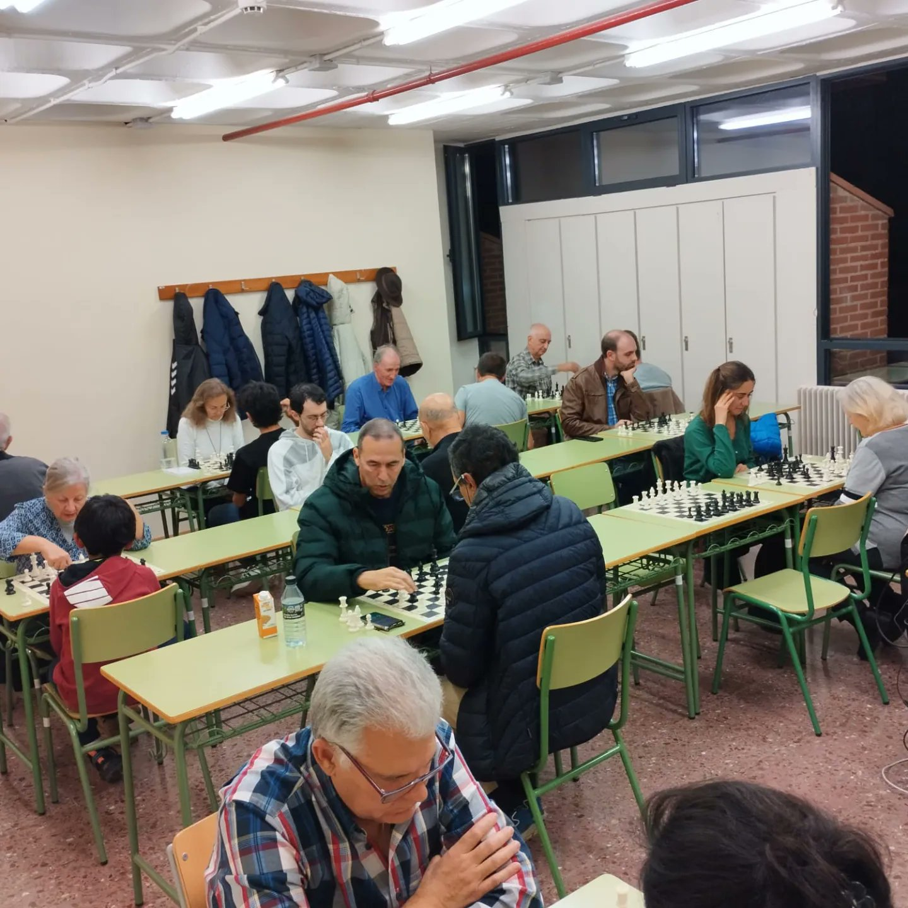

La asociación organiza una quedada para jugar al ajedrez todos los los <b>viernes de 18:00 a 21:00 en el aula 305 de la</b> <a href="https://maps.app.goo.gl/7sHc3DaDaFgaa4w77"><b>Uned Guadalajara</b>  - Calle de Atienza 4, 19003 Guadalajara</a>. En los meses de verano la quedada es al aire libre en el Parque de las Adoratrices.

## ¿Puedo ir aunque no sea miembro de la asocicación?

Sí. Todo el mundo es bienvenido.

## ¿Es gratis?

Sí. Trae sólo ganas de jugar al ajedrez.

## ¿Es sólo para adultos?

Todo el mundo es bienvenido - mujeres, hombres, adultos y niños.

